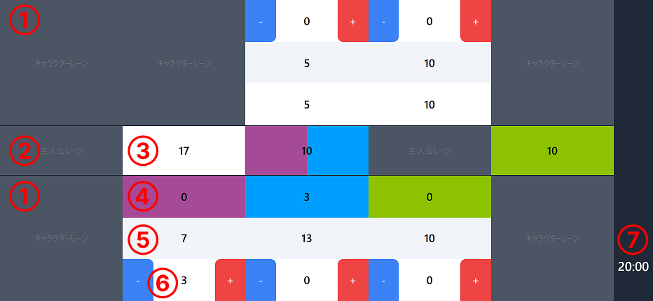

# [五等分の花嫁カードゲームカウンター](https://gh-nagata.github.io/5hanayome-cardgame-counter/)

「五等分の花嫁 カードゲーム」用のカウンターアプリです。

本アプリの利用によるいかなる損害やトラブルについても、開発者は一切の責任を負いません。  
詳細は [License](https://github.com/gh-nagata/5hanayome-cardgame-counter?tab=License-1-ov-file#readme) をご確認ください。

## 使い方

### ① キャラクターレーン
タップするとキャラクターが出現します。

### ② 主人公レーン
タップすると **必要花嫁力** が出現します。

### ③ 必要花嫁力
タップすると **必要花嫁力** の変更ができます。（6-10, 12, 17）  
「 **-** 」を選択すると **必要花嫁力** を消去します。  
アプローチされている場合、アプローチされているレーンによって背景色が変わります。

### ④ 合計花嫁力
**花嫁力** と **補助花嫁力** の合計が表示されます。  
アプローチ中は合計から **必要花嫁力** を引いたものが表示されます。  
タップすると色が変わり、その状態で **必要花嫁力** をタップするとアプローチ中となります。  
アプローチ中はアプローチしている **必要花嫁力** と同じ色になります。  
アプローチ中にタップするとアプローチ状態を解除できます。

### ⑤ 花嫁力
タップすると **花嫁力** の変更ができます。

### ⑥ 補助花嫁力
**花嫁力** の補助的にお使いください。  
数字をタップすると **補助花嫁力** が 0 に戻ります。

### ⑦ タイマー
20分タイマーです。タップするとカウントが始まります。  
カウント中にタップすると対戦終了となり、画面がリセットされます。（確認ダイアログが表示されます。）

## 今後の更新予定

- *dnd-kit* で移動・入れ替え機能の追加

## 寄付

